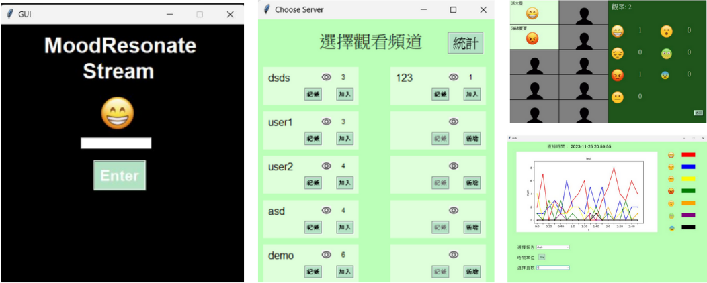

# LERA-BFERT: Live Emotional Resonance Application Based on Facial Expression Recognition Technology
> National Taiwan University of Science and Technology & Department of Computer Science and Information Engineering 

[English](./README.md) | [中文](./README.zh-TW.md)
## ✨ Overview

This program aims to enhance the viewing experience by creating **empathy** among the audience. At the same time, the streamer will be able to adjust the content according to the audience's response.

Streamers can also adjust the live-action content according to the audience's reaction. The methodology to capture the facial emotions of the audience immediately and effectively is based on the Dynamic Facial Emotion Recognition (DFER) method.

We improve the model based on dynamic facial emotion recognition by combining the micro-expression recognition model to find the model with the best performance. The preliminary results show that the model can detect the facial emotions of the audience **effectively** and in **real-time**.

We then aggregated all the audience's emotional information through the Google Sheets API and processed the information to make the results easy to understand. Eventually, we make the audience see other people's emotional responses in real-time to enhance the viewing experience.

The final result is that the audience can see other people's emotional reactions in real-time, which enhances the viewing experience.

## 🚀 Main Results

### ✨ Interface & Result  

You can find our Poster [here](pic/Project_Poster.png), also the report [here](pic/Project_Paper.pdf).

## 🔨 Installation

Please follow [requirements.txt](requirements.txt).

## ➡️ Preparation

Please create own google account and fillout the **.json** file by [documentation](https://developers.google.com/sheets/api/guides/concepts).

## 📍 Model

Download the model pre-trained from [this link](https://drive.google.com/file/d/1AySyaGGic-ZrdJp3p3tDpPANE6spaOhx/view?usp=drive_link) and put it into [this folder](model).

## ☎️ Contact 

If you have any questions, please feel free to reach me out at `ooo910809@gmail.com`.

## 👍 Acknowledgements

This project's model is built upon [VideoMAE](https://github.com/MCG-NJU/VideoMAE), [MAE-DFER](https://github.com/sunlicai/MAE-DFER) and [MMNET](https://github.com/muse1998/MMNet).
Thanks for their great codebase.